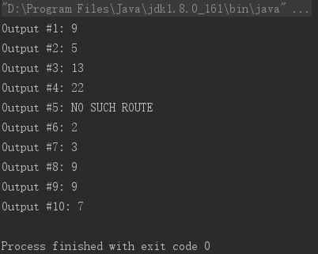
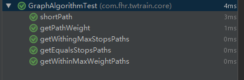

# twtrain #
twtrain是对于"Problem one: Trains"的解决方案，基于java语言开发和maven构建

## 运行环境 ##
* java8
* maven

## 设计思路 ##
* 图的存储结构因为邻接矩阵比较方便直观，故选用邻接矩阵存储（使用java的二维数组）
* 对于1-5问题，给定路线可直接计算距离，无复杂的算法
* 对于8、9问题的最短路径求解，这儿使用迪杰斯特拉最短路径算法（基于动态规划）
* 对于6、7、10问题，这儿抽象为图的深度遍历（DFS),使用递归+回溯法进行实现

## 如何运行程序 ##
 输入文件为resources目录下面的input.txt，有以下三种运行方式：
* 通过maven直接运行
  ```shell
   mvn exec:java -Dexec.mainClass="com.fhr.twtrain.core.App" -Dexec.classpathScope=runtime
  ```
* 也可通过maven打包为jar运行
  ```shell
     mvn package
     java -jar ./target/twtrain-1.0-SNAPSHOT.jar
  ```
* 还可通过idea或者eclipse等IDE运行

运行截图：

  

## 如何运行单元测试 ##
单元测试主要是针对最短路径、求路径和以及求路径数量三大核心算法的测试，单元测试用例已经编写完毕。
可以通过如下两种方式运行单元测试：
* 通过maven直接运行
  ```shell
    mvn test
   ```
* 通过idea或者eclipse等IDE运行

运行截图：

  

## 项目工程结构 ##
- 根目录
   - pom.xml: maven的构建配置文件
   - README.md: 项目的简短说明文档
   - src: 项目源文件目录
     - main: 主目录
       - java: java源文件，com.fhr.twtrain.core.GraphAlgorithm包括了图的几大算法实现，com.fhr.twtrain.core.GraphAlgorithm.APP是程序的main入口
       - resources: 配置和资源文件，input.txt是程序运行的输入文件
     - test: 测试目录
       - java：java单元测试文件，com.fhr.twtrain.core.GraphAlgorithmTest包括了图的几大算法的单元测试
       - resources： 单元测试资源文件（暂无）
   - target: 项目输出目录
   - run.PNG: 程序运行截图
   - test.PNG: 单元测试运行截图
   
## 核心方法说明 ##
* com.fhr.twtrain.core.GraphAlgorithm.getPathWeight(int[][] cost, int[] path)
  求解改定路径下的路径之和
* com.fhr.twtrain.core.GraphAlgorithm.shortPath(int[][] cost, int start, int end)
  求起点到终点的最短路径
* com.fhr.twtrain.core.GraphAlgorithm.getWithingMaxStopsPaths(int[][] cost, int start, int end, int maxStops)
  计算在经过的站最多为maxStops站的情况下，两点之间的所有路径
* com.fhr.twtrain.core.GraphAlgorithm.getWithinMaxWeightPaths(int[][] cost, int start, int end, int maxWeight)
 计算在经过的距离最多为maxWeight的情况下，两点之间的所有路径
* com.fhr.twtrain.core.GraphAlgorithm.getEqualsStopsPaths(int[][] cost, int start, int end, int equalsStops)
 计算在经过的站刚好为equalsStops的情况下，两点之间的所有路径
* com.fhr.twtrain.core.App.main(String[] args)
  程序入口点
  
## 作者信息 ##
```javascript
  var author = {
    name  : "范华燃",
    email : "834171100@qq.com",
    phone : 13060078142
  }
```